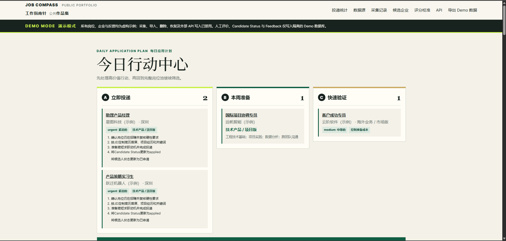
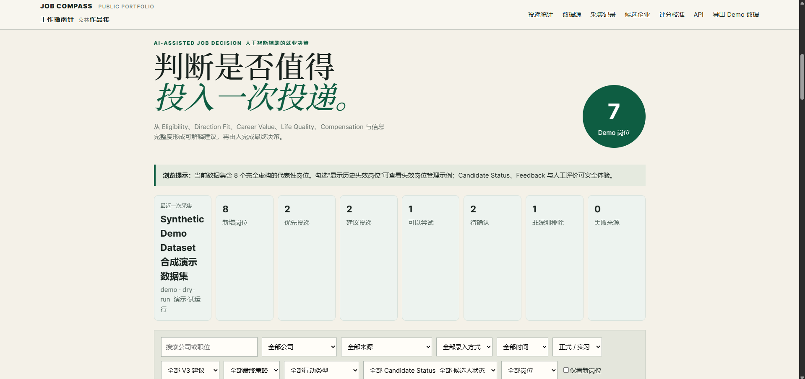
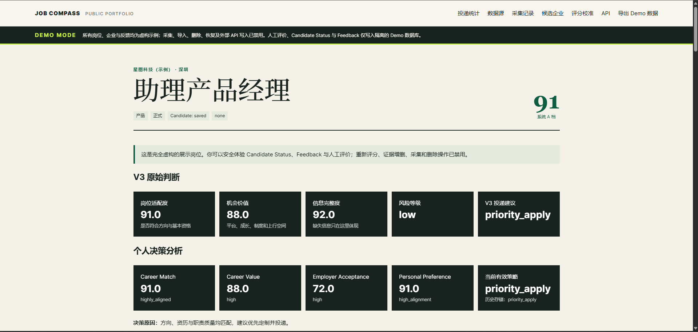
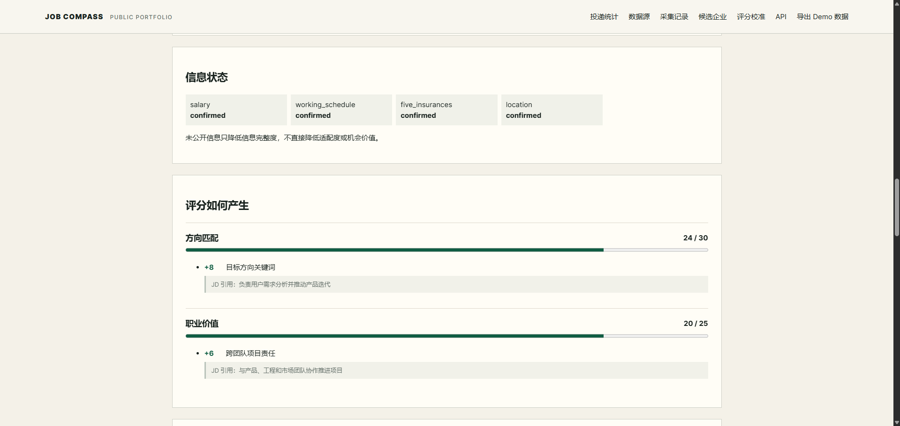
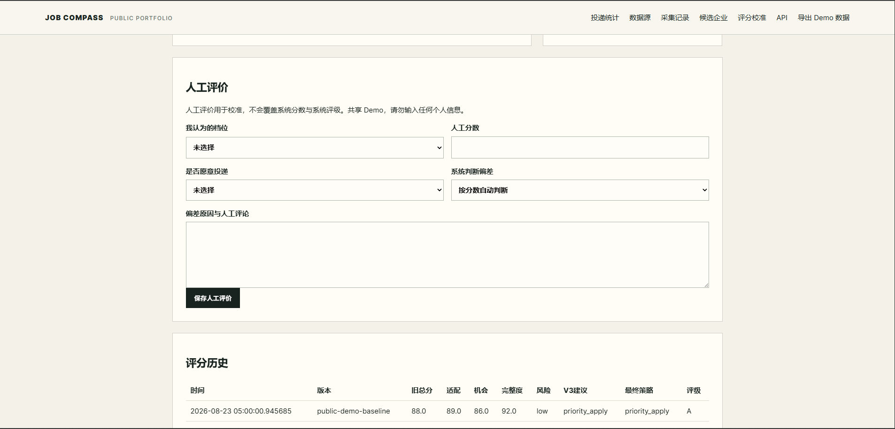

# Job Compass

**AI-assisted job discovery and decision system with explainable scoring, human review, and feedback-driven iteration.**

[**Current Live Demo**](https://job-compass-demo.onrender.com)

> Public portfolio version built with synthetic data and completely isolated from the private system.  
> A prebuilt static portfolio site now lives in `site/`. The existing Render Web Service is intentionally retained only during the migration/acceptance period.

---

## Static Portfolio Architecture

The production portfolio does not need a Python process:

```text
site/data/demo_jobs.json
        ↓
site/assets/app.js (filter, sort, statistics, detail routing)
        ↓
site/index.html + CSS
        ↓
Render Static Site / global CDN
```

- `site/index.html` provides the immediately visible application shell.
- `site/data/demo_jobs.json` is a sanitized snapshot of the existing eight Demo jobs.
- `site/assets/app.js` computes every count and runs search, filtering, sorting, details and Human-in-the-loop interactions in the browser.
- Job detail links use `?job=<id>`, so a direct visit or refresh still requests `index.html` and does not need an SPA rewrite.
- Candidate Status, Feedback and manual review are stored only in the visitor's browser (`localStorage`). They never leave the device.
- There are no runtime API, database, crawler, AI, Python, third-party CDN, font or image requests.

The former FastAPI application, Python dependencies and root `render.yaml` remain temporarily so the old Web Service can stay online while the new Static Site is validated. The Static Site does not read or execute any of them.

## Local Static Test

From the repository root:

```powershell
python -m http.server 4173 --directory site
```

Then open `http://127.0.0.1:4173/`. Do not double-click `index.html` with `file://`, because browsers can block the JSON request in that mode.

## Render Static Site Settings

Create a **new** resource with **Render → New → Static Site**. Do not convert or delete the existing Web Service yet.

| Field | Value |
|---|---|
| Repository | `job-compass-public` |
| Branch | `main` |
| Root Directory | `site` |
| Build Command | `echo "Static snapshot ready"` |
| Publish Directory | `.` |

No environment variables, database, disk, start command or health check are needed. The no-op build command exists only because Render's Static Site form expects a build step; the site is already committed in deployable form.

After the new URL passes desktop, mobile and resume-link checks, update the README and resume link to that Static Site URL. Keep the old Web Service for a short rollback window, then remove it separately.

---

## Product Overview

Job Compass started from a problem I repeatedly encountered in my own job search.

Finding openings was not the hardest part. The harder problem was deciding:

- whether I was actually eligible;
- whether the role matched my target direction;
- whether it was worth spending time on a tailored application;
- whether important information was missing;
- and what should be verified manually before making a decision.

I therefore designed Job Compass as a **decision-support workflow rather than a simple job crawler or resume-matching tool**.

The system connects job collection, JD parsing, eligibility checks, multi-dimensional evaluation, application recommendations, human review, status tracking and feedback into one workflow.

I defined the product requirements, decision logic, scoring framework, feature priorities, validation criteria and iteration direction. Codex supported implementation, while large language models were used for requirement discussion and iteration analysis.

---

## Product Demo

### Daily Application Plan

The system converts job evaluation results into an action-oriented queue rather than presenting a flat list of openings.



Roles can be grouped into actions such as immediate application, preparation, quick validation and manual confirmation.

---

### Job Discovery & Prioritization

Each role retains its source, status, recommendation and evaluation results so that job discovery and application decisions remain connected.



The goal is not simply to rank jobs by one similarity score, but to decide **where the next unit of application effort should go**.

---

### Multi-dimensional Decision Support

A job is evaluated across several dimensions rather than being reduced to a single opaque score.



Current dimensions include:

- Eligibility
- Direction Fit
- Career Value
- Life Quality
- Compensation
- Opportunity Value

Full-time roles and high-quality internships use different evaluation logic where appropriate.

---

### Explainable Scoring

The system preserves the reasoning behind a recommendation.



Each assessment can expose:

- **score** — the numerical result;
- **rule hit** — which signal affected the score;
- **JD evidence** — the source text supporting the judgment;
- **decision reason** — why the system recommends applying, tailoring, validating, confirming or skipping.

This makes the recommendation reviewable instead of treating it as a black-box output.

---

### Human-in-the-loop Review

AI-assisted recommendations do not directly become final application decisions.



The user can record:

- Candidate Status
- manual evaluation
- whether the role was actually applied to
- reasons for not applying
- interview outcomes
- disagreement with the system judgment

These signals remain separate from the original automated score and can later be used to identify systematic judgment errors and calibrate the decision logic.

---

## Why I Built It

Real-world job discovery creates a fragmented and noisy decision environment:

- roles are distributed across multiple platforms;
- duplicate and expired postings compete for attention;
- JDs frequently omit salary, schedule, benefits, travel requirements or role scope;
- manual screening is repetitive;
- a high semantic match does not necessarily mean a role is worth applying for;
- uncertain information often requires human confirmation rather than automatic judgment.

The product therefore reframes the problem from:

> **“Which JD looks most similar to my resume?”**

to:

> **“Is this opportunity worth applying to, how much effort should I spend on it, and what evidence supports that decision?”**

---

## Product Workflow

```text
Job Source / JD
        ↓
Parsing & Normalization
        ↓
Eligibility Check
        ↓
Multi-dimensional Evaluation
        ↓
AI-assisted Recommendation
        ↓
Human Review
        ↓
Candidate Status & Feedback
        ↓
Rule Calibration & Iteration
